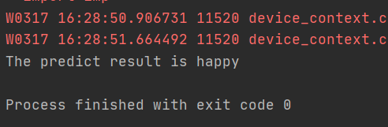
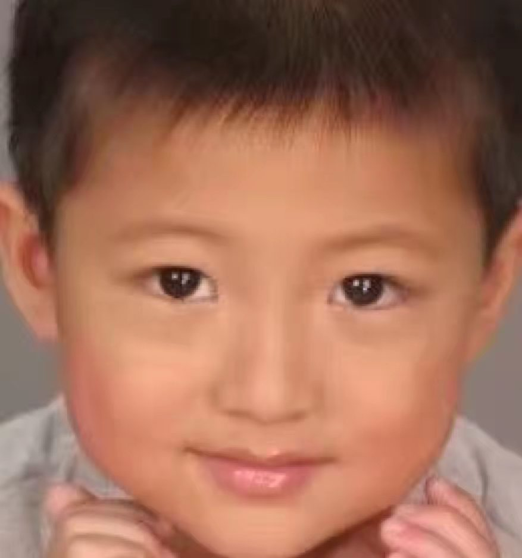

# Expression detection
A project aims to find the tiny difference on face and figure out the activity under the face 


***
```
#Modify according to your own path
datafile = './Data'
```

- **Train**:
A file to train the neural network based on PaddlePaddle

- **Predict**:
Based on the trained model to predict the input image and analyse the expression

- **Clean_data**:
Clean out the unfit data and make the available data done.


EX:

- 
- 

- Student majored in artificial intelligence from XDU
- [Personal Blog](https://blog.csdn.net/qq_49392169)
- QQ: 2539110495